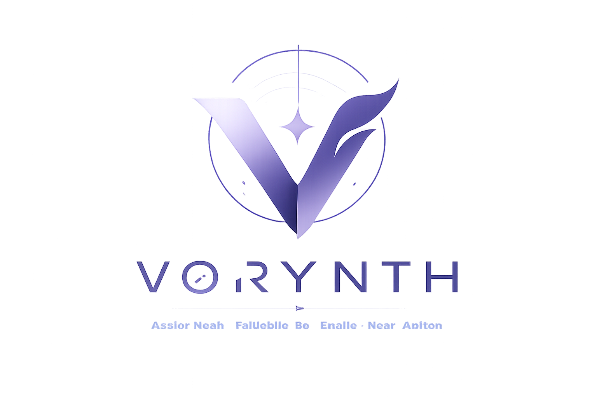

<p align="center">
  
</p>

# Vorynth

> **Less reading. More understanding.**

[](https://github.com/omidnw/vorynth/actions/workflows/ci.yml)
[](https://github.com/omidnw/vorynth/actions/workflows/package.yml)

[](LICENSE)

**Vorynth** is a local-first personal intelligence engine that turns the flood
of global information into a short, personalized intelligence brief. Spend
**minutes** understanding what matters instead of hours searching for it.

Collects from your trusted sources → filters the noise → AI understands the
context → delivers a concise briefing. Everything runs on **your device** —
your API keys, history, and insights stay under your control.

<p align="center">
  <a href="https://github.com/omidnw/vorynth">GitHub</a> ·
  <a href="https://github.com/omidnw/vorynth/releases">Releases</a> ·
  <a href="https://omidnw.github.io/vorynth/">Website</a> ·
  <a href="docs/GUIDE.md">Setup Guide</a>
</p>

---

## Why Vorynth?

Vorynth is a **constructed name** built from three parts:

| Part | Meaning |
| ---- | ------- |
| **Vor** | Vision, voyage, moving forward — seeing beyond the obvious |
| **Yn** | Intelligence network — connecting many sources into one layer |
| **Th** | Thought, depth — turning raw information into real understanding |

Together: *a forward-looking intelligence network that transforms global information into deeper understanding.*

Unlike a category name like "DevNewsAI," Vorynth describes a **mission** — one that scales beyond software into any domain where information matters.

---

## Quick start

```bash
git clone https://github.com/omidnw/vorynth.git
cd vorynth
pnpm install
pnpm dev
```

Open **http://localhost:5173** — the app is running.

> See [**docs/GUIDE.md**](docs/GUIDE.md) for prerequisites, detailed commands,
> cross-compilation, platform-specific notes (FreeBSD, Harmony OS, …), and
> troubleshooting.

---

## Architecture

```
Vorynth/
├── apps/
│   ├── desktop/                    Tauri v2 + React 18 + Vite + Tailwind CSS
│   │   ├── src/                    UI pages, components, i18n
│   │   └── src-tauri/              Rust shell — sidecar launcher + native window
│   └── core-engine/                NestJS + Fastify — intelligence runtime
│       ├── src/modules/
│       │   ├── collector/          RSS polling, rate limiting, per-source windows
│       │   ├── normalizer/         Dedup, classification, importance scoring
│       │   ├── intelligence/       LangGraph.js workflow (collect → analyze → brief)
│       │   ├── search/             FTS5 full-text + AI-assisted RAG search
│       │   ├── backup/             Export / restore / manage snapshots
│       │   └── llm/                Provider abstraction: OpenAI, Claude, Gemini, Groq
│       ├── data/                   SQLite database (better-sqlite3 + Drizzle ORM)
│       └── scripts/                Sidecar bundler (ncc + native addon)
└── packages/
    └── types/                      Shared TypeScript interfaces & DTOs
```

**Key principle:** The desktop app is a thin client. **Zero business logic in
React.** The engine owns everything — collection, normalization, AI analysis,
localization, and report generation.

---

## Features

- **Multi-source collection** — RSS feeds with per-source fetch windows and
  rate limiting. 13 seed sources covering AI, engineering, security & more.
- **LangGraph intelligence** — AI workflow: collect → normalize → dedup →
  rank → classify → analyze → brief. All local.
- **4 LLM providers** — OpenAI, Anthropic Claude, Google Gemini, Groq.
  Switch per-query or per-generate.
- **FTS5 full-text search** — blazing-fast keyword search with Persian/Arabic
  diacritic normalization and prefix matching.
- **AI-assisted RAG search** — ask questions in natural language; the engine
  retrieves relevant articles and answers with citations.
- **Period summaries** — daily, weekly, monthly AI-generated briefs with
  takeaways, recommended actions, and semantic themes.
- **Background jobs** — generation runs asynchronously with live progress
  reporting. Close the app, come back to your brief.
- **Backup & restore** — full database snapshots with manifest. One-click
  export, restore, delete.
- **i18n + RTL** — English & Persian (Farsi) UI. RTL auto-detection for
  AI output. More languages via standard ICU message format.
- **Dark mode** — system-aware theme with multiple accent colors.
- **Privacy first** — no cloud account. No telemetry. Your keys, your data.

---

## Cross-platform support

| Platform         | Support                 | Notes                                                                                       |
| ---------------- | ----------------------- | ------------------------------------------------------------------------------------------- |
| macOS 12+        | ✅ Native (ARM + Intel) | Full native experience                                                                      |
| Windows 10+      | ✅ Native (x86_64)      | Full native experience                                                                      |
| Linux (x86_64)   | ✅ Native               | deb, rpm, AppImage                                                                          |
| Linux (ARM64)    | ✅ Native               | Raspberry Pi 4+, ARM servers                                                                |
| FreeBSD (x86_64) | ✅ Native               | Cross-compiled from Linux                                                                   |
| Other BSDs       | 🟡 Linux compat         | Linux x86_64 binaries work via FreeBSD Linux ABI                                            |
| Harmony OS       | 🟡 Source only          | Run from source via `pnpm dev` — see [platform notes](docs/GUIDE.md#harmony-os-openharmony) |

---

## Packages used

| Package                                                                                    | Purpose                        |
| ------------------------------------------------------------------------------------------ | ------------------------------ |
| [Tauri v2](https://v2.tauri.app)                                                           | Desktop shell (Rust + webview) |
| [NestJS](https://nestjs.com)                                                               | Engine runtime + module system |
| [Fastify](https://fastify.dev)                                                             | HTTP server (inside engine)    |
| [better-sqlite3](https://github.com/WiseLibs/better-sqlite3)                               | SQLite driver                  |
| [Drizzle ORM](https://orm.drizzle.team)                                                    | Type-safe database queries     |
| [LangGraph.js](https://langchain-ai.github.io/langgraphjs/)                                | AI workflow orchestration      |
| [React 18](https://react.dev)                                                              | UI framework                   |
| [Tailwind CSS](https://tailwindcss.com)                                                    | Styling                        |
| [react-i18next](https://react.i18next.com)                                                 | Internationalization           |
| [@persian-tools/persian-tools](https://www.npmjs.com/package/@persian-tools/persian-tools) | Persian text normalization     |
| [iso-639-1](https://www.npmjs.com/package/iso-639-1)                                       | Standard language codes        |

---

## Screenshots

| Today's Brief | Search        | Settings      |
| ------------- | ------------- | ------------- |
| _Coming soon_ | _Coming soon_ | _Coming soon_ |

---

## Project status

Version **1.4.0** — active development. See the in-app **Settings → Changelog**
or the [changelog data](apps/desktop/src/features/changelog/changelog-data.ts).

### Roadmap

- [x] Core engine: collection, normalization, intelligence, FTS5 search, backup
- [x] Desktop app: brief, search, sources, settings, insights
- [x] i18n (English + Persian), RTL support, dark mode
- [x] Background jobs with live progress
- [x] 4 LLM providers (OpenAI, Claude, Gemini, Groq)
- [x] CI/CD: automated builds for 6 platforms
- [ ] Android / iOS mobile builds (Tauri v2 mobile)
- [ ] Harmony OS native support (pending Tauri/OHOS ecosystem)
- [ ] Plugin system for custom sources & analyzers

---

## License

MIT — see [LICENSE](LICENSE). Copyright © 2026 Omid Reza Keshtkar.

---

<p align="center">
  <sub>Built with ❤️ by <a href="https://github.com/omidnw">Omid Reza Keshtkar</a></sub>
  <br>
  <sub><a href="docs/GUIDE.md">📖 Setup Guide</a></sub>
</p>
